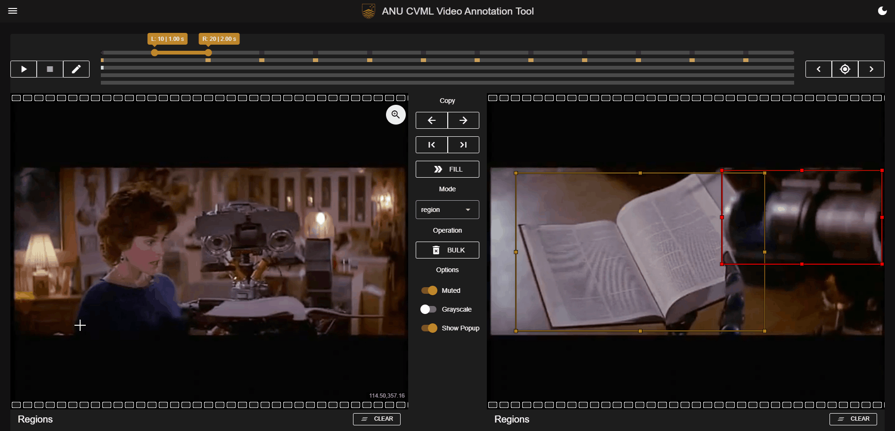
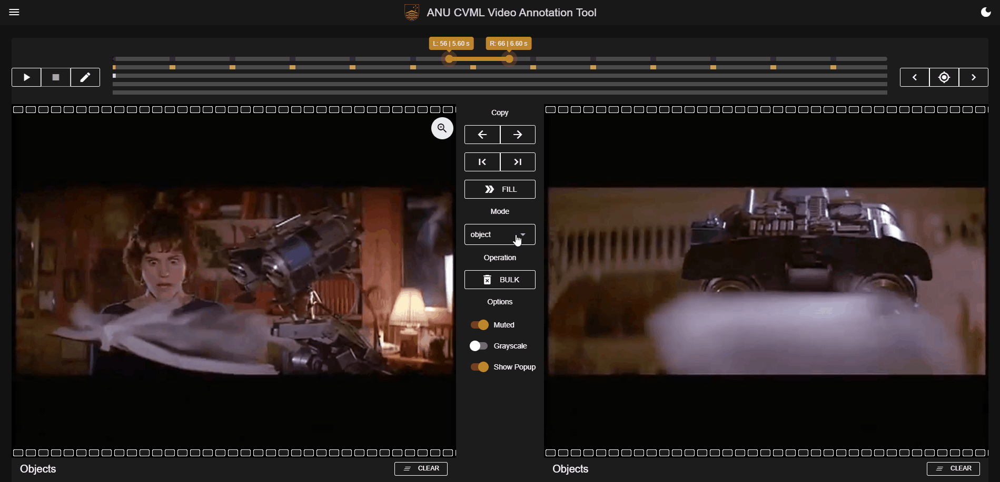
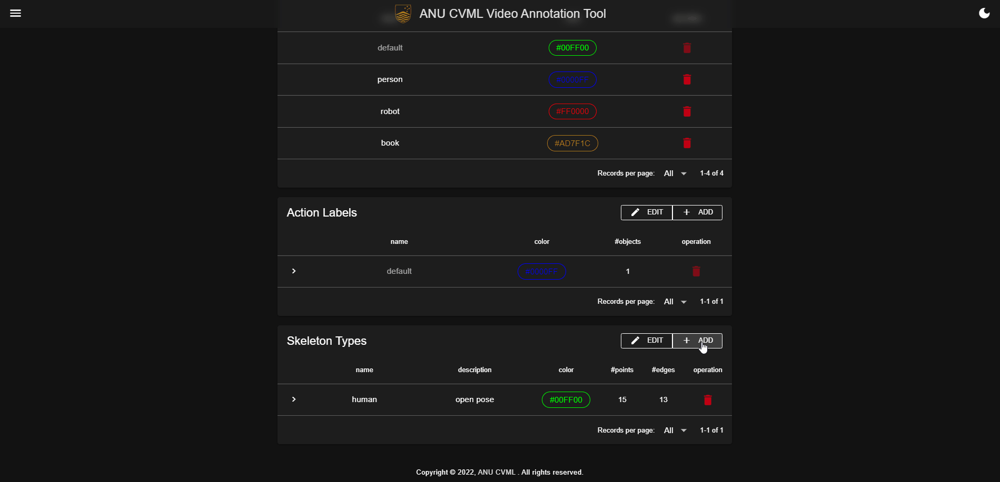

<div align="center">


# Vidat

_An in-browser video annotation tool developed by [ANU CVML](https://github.com/anucvml)._

[](https://github.com/anucvml/vidat/releases)
[](https://github.com/anucvml/vidat/releases)
[](https://github.com/anucvml/vidat/actions/workflows/cd.yaml)
[](https://github.com/anucvml/vidat)

[](https://users.cecs.anu.edu.au/~sgould/vidat2/)
[](https://users.cecs.anu.edu.au/~sgould/vidat2/?annotation=annotation/example.json)
[](https://vidat2.davidz.cn/)
[](https://vidat2.davidz.cn/?annotation=/annotation/example.json)
[](https://www.youtube.com/playlist?list=PLD-7XrNHCcFLv938DO4yYcTrgaff9BJjN)

</div>

The aim of this project is to develop a high-quality video annotation tool for computer vision and machine learning
applications with the following desiderata:

1. Simple and efficient to use for a non-expert.
2. Supports multiple annotation types including temporal segments, object bounding boxes, semantic and instance regions,
   tracklets, and human pose (skeleton).
3. Runs in a browser without external libraries or need for server-side processing. But easy to plug-in a back-end for
   heavy "in-the-loop" processing (e.g., segments from bounding boxes or frame completion from partial labels).
4. Integrates easily with crowd-sourced annotation services (e.g., Amazon Mechanical Turk).
5. Compatible with all (most) modern browsers and operating systems including tablets.
6. Secure. Data does not need to leave the local machine (since there is no server-side processing).
7. Open-source.

## Screenshots

### Object


### Region



### Skeleton



### Skeleton Type



### Action


## Usage

### Annotate local videos

Just open [Host](https://vidat2.davidz.cn) and open a local video, you are good to go!

### Annotate remote videos

You need to [deploy](#deployment) Vidat first, and then use [URL parameters](#url-parameters) to load the video into
Vidat. Please note that Vidat does **not** support online YouTube videos due
to [Cross-Origin Resource Sharing (CORS)](https://developer.mozilla.org/en-US/docs/Web/HTTP/CORS).

### Integrate with Amazon Mechanical Turk (MTurk)

1. **Prepare tasks**
   1. [Deploy](#deployment) Vidat on a server which can access to the videos and annotation (config) files.
   2. Generate URLs for each task,
      e.g. `https://example.com?annotation=task1.json&submitURL=http%3A%2F%2Fexample2.com%3Ftoken%3D123456`.
2. **Dispatch tasks on MTurk**
   1. Create a new MTurk task with survey template, replace the survey link with task link.
   2. Create a batch with generated URLs.
3. **Collect submissions**
   1. Build up an independent API backend (see `/tools/backend/` for a simple implementation) that handles submissions.

Submission API:

**Request**

```text
POST <submitURL>
content-type: application/json
<annotation>
```

**Respond**

```text
content-type: application/json
{
    type: '' // color: "primary" (default) | "secondary" | "accent" | "dark" | "positive" | "negative" | "info" | "warning"
    message: '' // notify the user (required)
    clipboard: '' // copy to user's clipboard (optional)
}
```

## Deployment

> Note that this is only necessary if you want to do development or host your own version of the tool. If you just want to label videos then you can use one of the host servers linked to above (data will remain on your local machine; it will not be sent to the host server).

1. Download our latest [release](https://github.com/anucvml/vidat/releases). Note that the `pre-release` is
   automatically generated and should **not** be used in production.
2. Unzip all files and put them behind a web server ([Nginx](http://nginx.org/), [Apache](http://httpd.apache.org/),
   etc.). Note that open `index.html` in your explorer does **not** work.
3. Open in your favourite browser.

## URL Parameters

> All the keys and values are **not** case-sensitive.
>
> **Note** if you are using an external URL for `annotation`, `video`, `config` or `submitURL`,
> please make sure you are following [Cross-Origin Resource Sharing (CORS)](https://developer.mozilla.org/en-US/docs/Web/HTTP/CORS).
> And they need to be [URL encoded](https://developer.mozilla.org/en-US/docs/Web/JavaScript/Reference/Global_Objects/encodeURI) if there is any special characters.

### `annotation`

**Default** `null`

**Example** `/annotation/exmaple.json`, `http://exmaple/static/annotation/exmaple.json`

Path to the annotation file. Vidat will load the video, annotation and configurations from this file. This parameter has
higher priority than `video`, `config`, `defaultFPS` and `defaultFPK`. Please refer
to [File Formats - Annotation](#file-formats) for format details.

### `video`

**Default** `null`

**Example** `/video/exmaple.mp4`, `http://exmaple/static/video/exmaple.json`

Path to the video file. Please refer to [`decoder`](#decoder) for more information.

### `config`

**Default** `null`

**Example** `/config/exmaple.json`, `http://exmaple/static/config/exmaple.json`

Path to the video file. Please refer to [File Formats - Config](#file-formats) for format details.

### `mode`

**Default** `null`

**Example** `object` | `region` | `skeleton`

Specify current mode for Vidat.

### `zoom`

**Default** `false`

**Example** `true` | `false`

Whether toggle zoom on.

### `sensitivity`

**Default** `hasTouch ? 10 : 5`

**Example** `Integer >= 1`

When detecting points / edges, the number of pixel(s) between you mouse and the annotation.

### `defaultFPS`

**Default** `10`

**Example** `1 <= Integer <= 60`

The default frame per second used when extracting frames from the given video.

### `defaultFPK`

**Default** `50`

**Example** `Integer >= 1`

The default frame per keyframe used when generating keyframes.

### `decoder`

**Default** `auto`

**Example** `auto` | `v1` | `v2`

The video decoder used for frame extracting.

`v1` uses `<canvas>` as a video decoder,
by [`pause` - `draw` - `play` - `wait for timeupdate` strategy](https://stackoverflow.com/revisions/32708998/5). It is
the most reliable and compatible methods for most cases. But it is slow and computational inefficient.

`v2` uses [`WebCodecs.VideoDecoder`](https://developer.mozilla.org/en-US/docs/Web/API/VideoDecoder), it takes the
advantages of native video decoder built inside the browser. It is way faster than `v1` but lack of support from old
browsers.

`auto` Vidat will determine which one to use for you.

See [VideoLoader Wiki](https://github.com/anucvml/vidat/wiki/VideoLoader) for details.

### `showObjects`

**Default** `true`

**Example** `true` | `false`

Whether to show `object` mode related components.

### `showRegions`

**Default** `true`

**Example** `true` | `false`

Whether to show `region` mode related components.

### `showSkeletons`

**Default** `true`

**Example** `true` | `false`

Whether to show `skeleton` mode related components.

### `showActions`

**Default** `true`

**Example** `true` | `false`

Whether to show `action` related components.

### `muted`

**Default** `true`

**Example** `true` | `false`

Whether to mute the video when playing.

### `grayscale`

**Default** `false`

**Example** `true` | `false`

Whether to grayscale the video.

### `showPopup`

**Default** `true`

**Example** `true` | `false`

Whether to show quick popup when finishing annotating an object/region/skeleton.

### `submitURL`

**Default** `null`

**Example** `submitURL=http%3A%2F%2Fexample.com%3Ftoken%3D123456`

URL used for submitting annotation.

### Examples

```
http://example.com?showObjects=false&showRegions=false&showSkeletons=false
```

This will show action only.

```
http://example.com?mode=skeleton&showPopup=false
```

This will set the current mode to skeleton and disable popup window.

```
http://example.com/index.html?submitURL=http%3A%2F%2Fexample.com%3Ftoken%3D123456
```

There will be a button shown in the side menu which will `POST` the annotation file to
`http://example.com?token=123456`.

## File Formats

**Config**

```json
{
  "objectLabelData": [
    {
      "id": 0,
      "name": "default",
      "color": "<color>"
    }
  ],
  "actionLabelData": [
    {
      "id": 0,
      "name": "default",
      "color": "<color>",
      "objects": [0]
    }
  ],
  "skeletonTypeData": [
    {
      "id": 0,
      "name": "default",
      "description": "",
      "color": "<color>",
      "pointList": [
        {
          "id": 0,
          "name": "point 1",
          "x": -10,
          "y": 0
        },
        {
          "id": 0,
          "name": "point 2",
          "x": 10,
          "y": 0
        }
      ],
      "edgeList": [
        {
          "id": 0,
          "from": 0,
          "to": 1
        }
      ]
    }
  ]
}
```

See [`public/config/example.json`](src/public/config/example.json) for am example.

**Annotation**

```json
{
  "version": "2.0.0",
  "annotation": {
    "video": {
      "src": "<path to video>",
      "fps": "fps",
      "frames": 0,
      "duration": 0,
      "height": 0,
      "width": 0
    },
    "keyframeList": [0],
    "objectAnnotationListMap": {
      "0": [
        {
          "instance": 0,
          "score": 0,
          "labelId": 0,
          "color": "<color>",
          "x": 0,
          "y": 0,
          "width": 0,
          "height": 0
        }
      ]
    },
    "regionAnnotationListMap": {
      "0": [
        {
          "instance": 0,
          "score": 0,
          "labelId": 0,
          "color": "<color>",
          "pointList": [
            {
              "x": 0,
              "y": 0
            },
            {
              "x": 0,
              "y": 0
            },
            {
              "x": 0,
              "y": 0
            }
          ]
        }
      ]
    },
    "skeletonAnnotationListMap": {
      "0": [
        {
          "instance": 0,
          "score": 0,
          "centerX": 0,
          "centerY": 0,
          "typeId": 0,
          "color": "<color>",
          "_ratio": 1,
          "pointList": [
            {
              "id": -1,
              "name": "center",
              "x": 0,
              "y": 0
            },
            {
              "id": 0,
              "name": "point 1",
              "x": -10,
              "y": 0
            },
            {
              "id": 1,
              "name": "point 2",
              "x": 10,
              "y": 0
            }
          ]
        }
      ]
    },
    "actionAnnotationList": [
      {
        "start": 0,
        "end": 0,
        "action": 0,
        "object": 0,
        "color": "<color>",
        "description": ""
      }
    ]
  },
  "config": "<config>"
}
```

See [`public/annotation/example.json`](src/public/annotation/example.json) for am example.

## Development

See [Wiki](https://github.com/anucvml/vidat/wiki#further-development) for details.

## Design

See [Design Wiki](https://github.com/anucvml/vidat/wiki/Design) for details.

## Citing

If you use Vidat for your research and wish to reference it, please use the following BibTex entry:

```
@misc{zhang2020vidat,
  author =       {Jiahao Zhang and Stephen Gould and Itzik Ben-Shabat},
  title =        {Vidat---{ANU} {CVML} Video Annotation Tool},
  howpublished = {\url{https://github.com/anucvml/vidat}},
  year =         {2020}
}
```

## Star History

[](https://star-history.com/#anucvml/vidat&Date)
