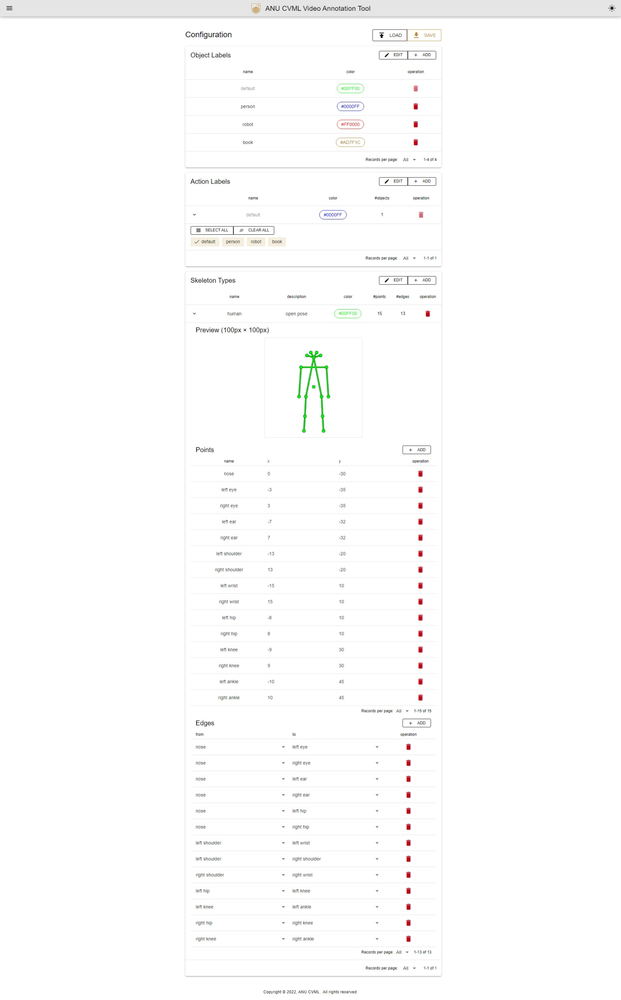
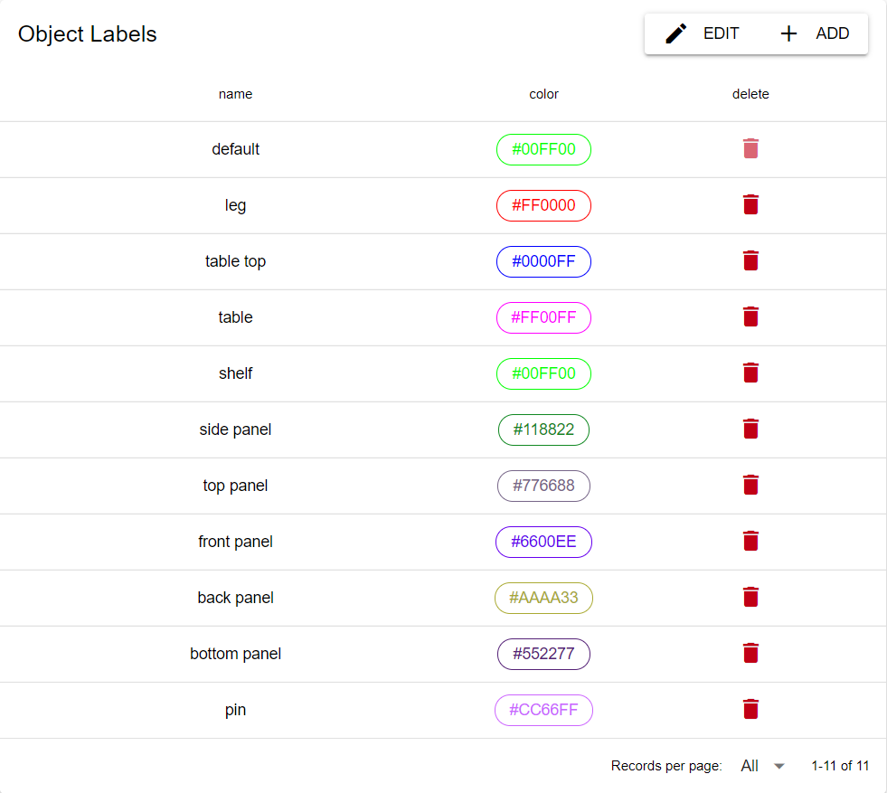
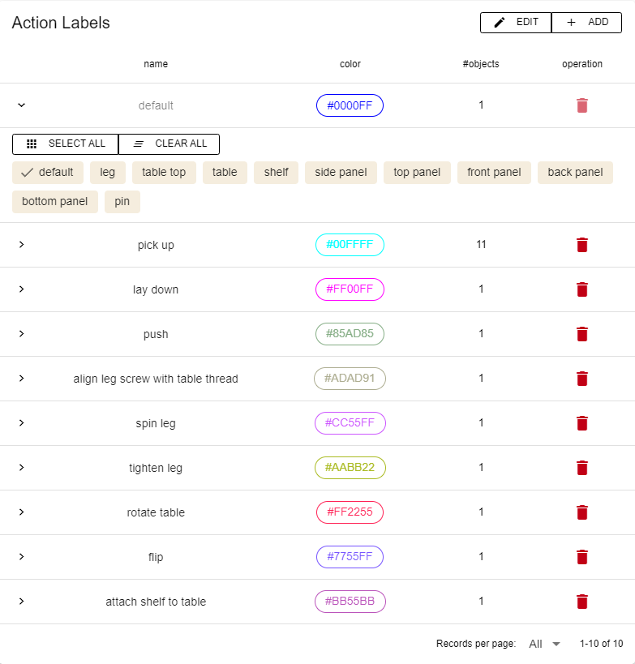
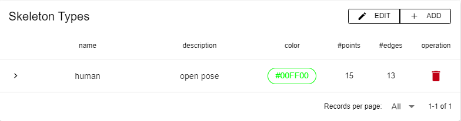
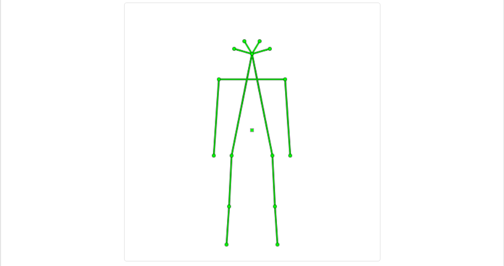

# Configuration

- configuration page container

## Screenshot

## Components

- **ObjectLabelTable** table for object label
  
- **ActionLabelTable** table for object label
  
- **SkeletonTypeTable** table for skeleton type
  
  - **SkeletonTypePreview** preview for skeleton type
    
