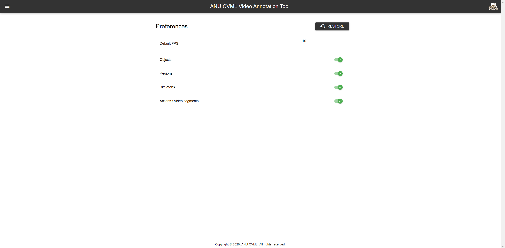

# Preference

- **Default FPS** the default fps for video
- **Objects** show objects mode or not
- **Regions** show regions mode or not
- **Skeletons** show skeletons mode or not
- **Actions / Video segments** show actions panel or not

## Screenshot

