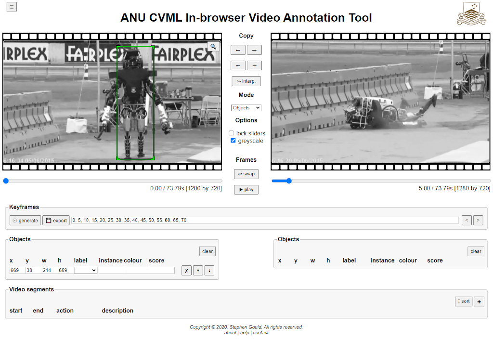

# Design Notes

## Frame-level Annotations

### Bounding Boxes

| Attribute | Description |
|-----------|-------------|
| x         | x-coordinate of top-left corner (**required**) |
| y         | y-coordinate of top-left corner (**required**) |
| width     | bounding box width (**required**) |
| height    | bounding box height (**required**) |
| labelId   | object type contained in bounding box |
| instanceId | integer indicating the instance of this type (may also be used for defining tracklets) |
| colour    | colour to render the bounding box (overrides label colour) |
| score     | score or confidence associated with the bounding box |
| comment   | free-text comment |

**Operations:** add, delete, edit, move, resize, copy (to another frame), visualize, interpolate (between two frames, objects with same `trackId`)

### Polygon Regions

TODO

### Human and Hand Poses (Skeletons)

TODO

## Video-level Annotations

### Keypoints

| Attribute | Description |
|-----------|-------------|
| timestamp | timestamp associated with the keyframe |

**Operations:** generate (sequence), add, delete, jump to, jump to next, visualize, export frames

### Video Segments (Clips)

| Attribute | Description |
|-----------|-------------|
| start     | beginning of clip (in seconds) (**required**) |
| end       | end of clip (in seconds) (**required**) |
| description | free-text description of the video segment |
| actionId  | action associated with the video segment |

**Operations:** add, remove, edit, jump to

## File Formats

### Video Files

Any video that can be processed by the HTML5 `video` element.

### Configuration (Object and Action Labels)

Stored as colon-separated pairs of `labelId` and (default) `colour`, one per line.
The `labelId` should be a string composed of letters, numbers and underscore.
The `colour` is a `#` followed by hexadecimal byte codes for red, green and blue (e.g., `#ff0000` for red).

### Annotations

TODO --- indexed by time (not frame)

### Preferences

User preferences (such as GUI options) are saved in browers local storage between sessions.

## Source Code

The software is all written in Javascript and designed to be compatible with all modern browers (including tablets).
It should not require any components to be installed on the users machine nor any software running on a server.

The tool is invoked by loading `index.html`. The URL query string may include parameters for fetching from the web. These include:
* `video`: a URL for a video to fetch for annotation
* `config`: a URL for a configuration file containing object and action labels
* `anno`: a URL for an annotation file for initial annotations
* various perference settings (e.g., for showing/hiding GUI elements)

## Prototype

## Main Classes

* `ObjectBox`, `PoylgonRegion`, `Skeleton`, `VidSegment`: Various classes representing each annotation type. Responsible for holding attributes, overlaying (drawing) the annotation on a video frame, and basic operations for interacting with and modifying the annotation.
* `AnnotationContainer`: Holds all the annotations for a given video including frame-level and video-level annotations.
* `LabelConfig`: Stores configuration of labels (e.g., object names and colours).
* `ANUVidLibPreferences`: Stores preferences for the annotation tool (e.g., state of GUI checkboxes).
* `ANUVidLibManager`: Overall control logic for the annotation tool including interaction with all the GUI elements (defined in `index.html`).
